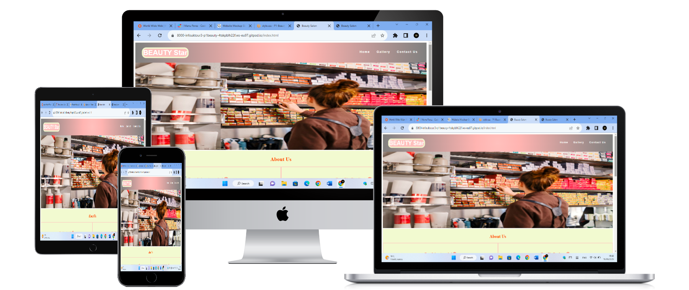
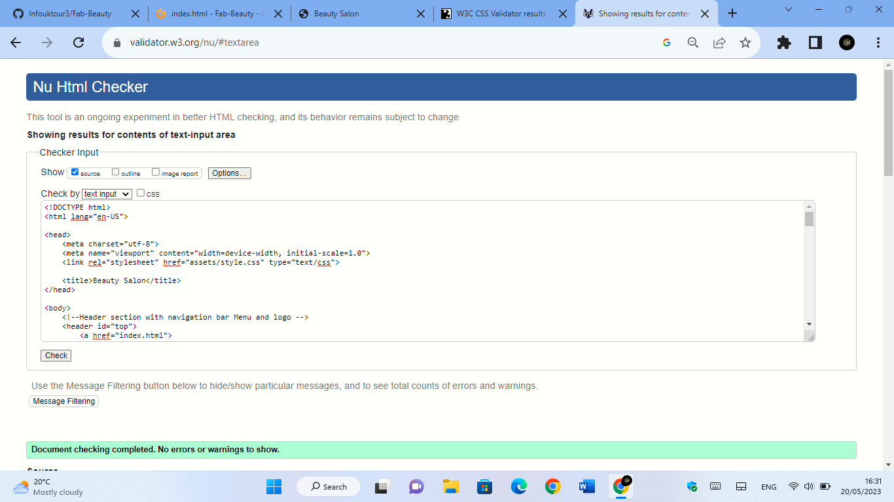
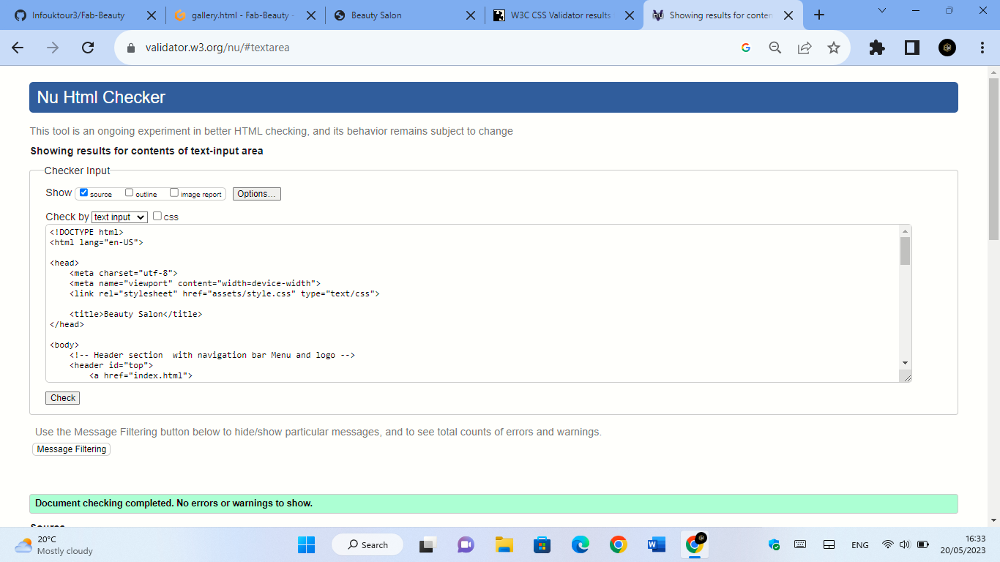
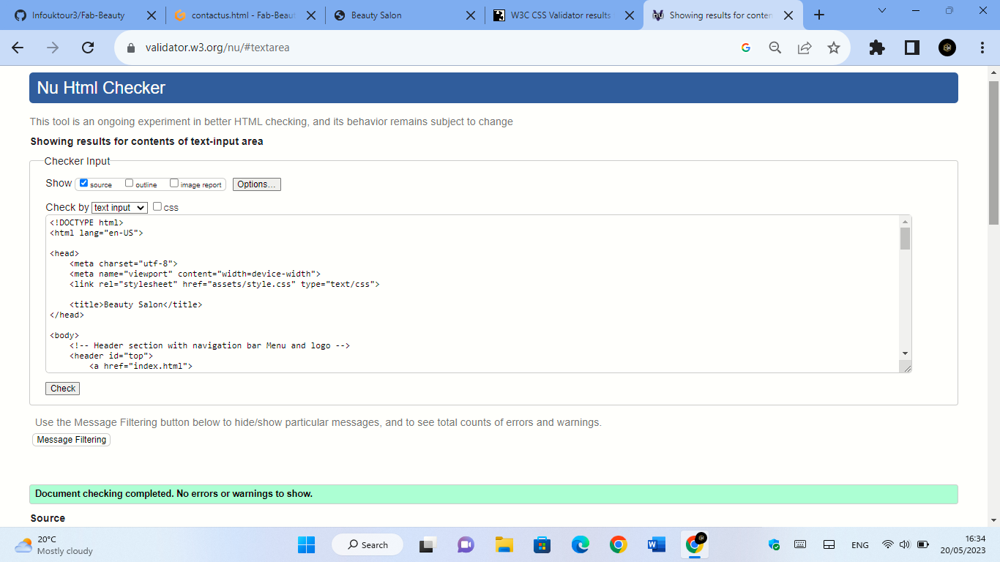
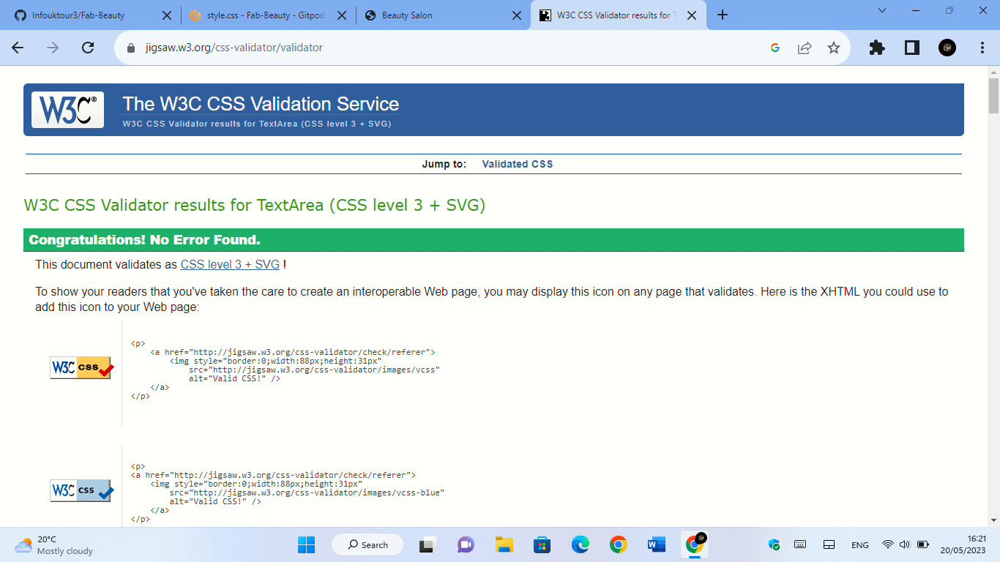

# Fab-Beauty

 

[View the live project here.](https://infouktour3.github.io/Fab-Beauty/)

This is the main Beauty Salon website. It is designed to be responsibe on a range of devices, making it easy to navigate for the reader and visitors.

## User Experience (UX)

### User stories
Looked into Balsamiq to have an idea and carried on with word file coverted in pjg [image](docs/WIREFRAMESpage01.jpg)[image](docs/WIREFRAMESpage02.jpg)[image](docs/WIREFRAMESpage03.jpg)

 #### First Time Visitor Goals
 1. The website is made to read and understand the business fast and the site shows the business services with images and words so the visitors can understand the business at the first glance.
 2. The User will be able to easily navigate throughout the site to find content through the top bar menu and the visitor can decide which page is more useful for them and if the get lost with some info they can go back to the Home page.
 3. Visitors want also verify the business through the social media to see how many followers and comments the business got to determine the trust and the age of the business, the three more famous social-media are added with a link that take the user inside the choseen social-media they want most to see.

 #### Returning Visitor Goals
1. Returning Visitor wants to find more information about products and services the business provides.
2. Returning Visitor wants make sure that the comapany is easy to reach with a landline or mobile phone number with its phisical location where it has been added.
3. Returning Visitor wants to find social media links and I have created 3 pmain sources of social-media link that take to the visitor inside the social-media page in a different window.

#### Frequent User Goals
 1. Frequent User wants to check new products arrival or products that in that moments they need,  by subscribe sign-up the user got access to a news products or get informed on the new arrival date, plus it can be chached in the social-media link.
 2. User wants to check some new extra information through post and social media to see if the business is healfy, creating the social-media links give at the business more transparency and in the same time more trust at the user.
 3. User wants to sign up to book an appointment for treatments or consutation or simply to gather more info before go haed with the choise they want, on the contact us page the visitor will be able to sign-up with an easy steps form that will help the visitor to don't get boder if it is too complicated to fill in.

### Design
#### Colour Scheme
     The predominate colour is pink with some grey and white gradiants to make some effect and make the site more attractive, with some light pink colour around the pages to be more tune with a beauty salon business.
    
#### Typography
The font used on the  website are Arial and Sans Serif as their are the most common font used today the font is cleaned is shows good read letters for all reader, even when the web site is used with different devices. 
#### Imagery
The first image is posted just straight under the header to catch the visitors attention and transmit the business message. [image](assets/photo/salonx1.jpg)

### Wireframes
- Home Page Wireframe - [View](docs/WIREFRAMESpage01.jpg)
- Gallery Wireframe - [View](docs/WIREFRAMESpage02.jpg)
- Contact Us Page Wireframe - [View](docs/WIREFRAMESpage03.jpg)

## Features
  

## Technologies Used
Laptop

### Languages Used

-   HTML5
-   CSS3

### Frameworks, Libraries & Programs Used

1. [Bootstrap 4.4.1:]
    - Bootstrap has been visited to assist me with the idea to create a responsiveness webssite and navigation bar it help me a bit but I used at the end w3 school site.
1. [Hover.css:] [view](/assets/style.css) (https://github.com/)
    - Hover.css was used on the top bar on the Logo and on the right navigations words to move from one page and another and return on it also has been added the hover for the social media links on the website footer.
1. [Font Awesome:](https://fontawesome.com/)
    - Font Awesome was used on the first and last page of the site to decorate some parts with icons for aesthetic and UX purposes.
1. [Git](https://git-scm.com/)
    - Git was used for version control by utilizing the Gitpod terminal and workspace to save the project and to commit to Git and Push to GitHub in the repositore the project.
1. [GitHub:](https://github.com/)
    - GitHub has been used to store the projects code after being pushed from Gitpod and workspace. Plus to cloen and deploy my project.
1. [Pexels:] (https://www.pexels.com/)
    - Pexels was used to add clean images to the website expecialy on the home page and gallery to resize the image I used the laptop correction photo.
1. [Balsamiq:](https://balsamiq.com/)
    - Balsamiq was visited to gather some idea on starting the design process even if I used my imagination at the end and created it with a word file and coverted in pjg. [image](docs/WIREFRAMESpage01.jpg) [image](docs/WIREFRAMESpage02.jpg) [image](docs/WIREFRAMESpage03.jpg)

1.  [jQuery:](https://getbootstrap.com/docs/4.5/getting-started/introduction/)
    - jQuery find some information in bootstrap and in code istitue(https://learn.codeinstitute.net/courses/course-v1:CodeInstitute+CSE101+2020_Q2/courseware/be0e510a3aca4bccb6e0bba4cf7cf06b/b47eaee24847486eb4424dfa29890cc0/)  on use to have a responsive website for different devices. I have also used different source like youtube and W3school sites to improve the responsiveness of the website.

## Testing

I have tested the website on W3C Markup Validator and W3C CSS Validator Services were used to validate every page of html and css of the project to ensure there were no syntax errors. A lot of  range of testing was done to ensure that all pages were linking correctly. The website has been deployed also trough GitHub for futher testiung.

## Deploying
The website has be deployed on git hub pages by complete the following steps:
- Go to the main repository
- Click setting
- Click the page tab on the left list
- Under branch select main
- Click save
The website is now live and can be found 

## Clone
The website has been cloned in the GitHub platform from P1-Beauty to Fab-Beauty, following this steps:
- GitHub home-page 
- Repositories
- Open the project
- n the code bottom open the arrow list ,and press copy bottom and it will be cloned on the repositories page.

### Code

- html and css were written through github (https://infouktour3-fabbeauty-vehklp0rvxa.ws-eu97.gitpod.io/) workspace/repositories

### Content

-   All content was written by myself.

### Media/Images

-  All Images were founded in Pexels.com (https://www.pexels.com/) and ammend accordely by myself.
- Used font awesome to add icons to the social-media links and on the about us section and time-table section to make more ahestetic the design (https://fontawesome.com/icons).
[image](assets/photo/certificate.webp)[image](assets/photo/GoogleMap.webp) [image](assets/photo/newproduct.webp) [image](/assets/photo/p1.jpg) [image](/assets/photo/p2.jpg)[image](/assets/photo/p3.jpg)
[image](/assets/photo/p4.jpg)[image](/assets/photo/p5.jpg)[image](/assets/photo/p6.jpg)[image](/assets/photo/p7.jpg)[image](/assets/photo/p8.jpg)[image](/assets/photo/p9.jpg)[image](assets/photo/salonx1.jpg)
[image](assets/photo/sol10.jpg)[image](assets/photo/sol11.jpg) [image](assets/photo/sol12.jpg)

### Acknowledgements

-   To the tutor support at Code Institute.

